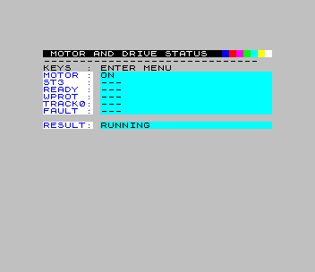
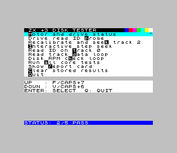
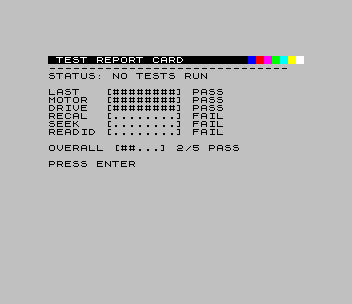
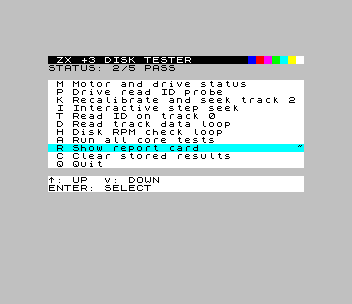
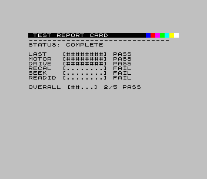

# zx3-drive-tester

⚠️ Not fully tested on all +3 hardware variants — no guarantee it won't break your floppies. You have been warned! ⚠️

[](https://github.com/corbym/zx3-disc-check/actions/workflows/smoke-test.yml)

A low-level ZX Spectrum +3 floppy drive diagnostic utility written in C and built with **z88dk**. Communicates directly with the internal +3 floppy controller (uPD765A compatible) via dedicated I/O ports. No BASIC, no OS — raw FDC commands only.

## Menu

| Key | Test | Description |
|-----|------|-------------|
| `M` | Motor/Drive Status | Spin up motor, read ST3, report ready/write-protect/track-0 bits |
| `E` | Read ID Probe | Issue READ_ID and report full ST0/ST1/ST2 register decode; works even with no disk |
| `B` | Recalibrate Test | Recalibrate to track 0 then seek to track 2; validates each step independently |
| `I` | Interactive Seek | Step the head track by track; shows current PCN and ST0 after each move |
| `T` | Read ID Track 0 | Read sector ID from track 0 and show CHRN tuple; requires a readable disk |
| `D` | Read Data | Continuous sector read loop; `J`/`K` change track, `F`/`V` scroll hex+ASCII panel |
| `H` | Disk RPM Check | Live rotational speed measurement; displays RPM, pass/fail counts and active phase |
| `A` | Run All | Run Motor, Read ID Probe, Recalibrate, and Read ID in sequence; show summary report |
| `R` | Show Report | Display last run results (PASS / FAIL / NOT RUN per test) |
| `C` | Clear Results | Reset all stored test results |
| `Q` | Quit | Exit to BASIC |

> **Run All scope**: `A` runs the four core tests (M, E, B, T) only. The RPM check (`H`), interactive seek (`I`), and read-data loop (`D`) are not included because they are continuous loops that require a user exit.

### Navigation

| Key(s) | Action |
|--------|--------|
| `F` / `CAPS+7` | Move selection up (shown on menu) |
| `V` / `CAPS+6` | Move selection down (shown on menu) |
| `W` / `S` | Move selection up / down (unlabelled alternates) |
| `ENTER` | Run selected test |
| Direct hotkey (`M`, `E`, `B` …) | Jump directly to that test |

### Reading the Test Cards

Every test screen has a `LAST` line and an `INFO` line in the lower body:

| Line | Purpose |
|------|---------|
| `LAST` | Most recent status or result word (`SAMPLE OK`, `SEEK FAIL`, `RUN`, etc.) |
| `INFO` | Current activity or detail (`READ ID`, `RECAL`, `RID+DAT`, `PERIOD OK`, etc.) |

The `INFO` line updates to show what the drive is **actively doing**, not just the last completed action. This is more precise than the drive LED, which simply reflects whether the motor is powered.

## Diagnostics

### Motor / Drive Status (`M`)

Spins the motor, reads ST3, and reports the ready, write-protect, and track-0 signal lines. This is a single-shot test; the motor is stopped before the result is shown.

### Read ID Probe (`E`)

Issues `RECALIBRATE` then `READ ID` and decodes the full ST0/ST1/ST2 result. Unlike the Read ID Track 0 test, this probe is **informational only** — its result does not write to the report-card slots.

### Recalibrate and Seek Test (`B`)

Runs in three independently-reported stages:

1. **Drive ready** — reads ST3 and checks the `RY` bit. Failure: no disk, door open, or motor cable.
2. **Recalibrate** — steps head inward until track-0 sensor fires. Failure: RECAL command rejected or seek-complete interrupt never arrived. ST0 and PCN are shown.
3. **Seek to track 2** — steps outward two tracks. Failure: seek command rejected or PCN did not reach 2. ST0 and PCN are shown.

If the test shows **FAIL on real hardware** but the drive appears mechanically sound:
- Run **Motor/Drive Status** first to confirm `RY=1` and `T0=1` (head at track 0 after a prior recal).
- Failing RECAL with PCN stuck at a non-zero value → stiff/dirty head mechanism or worn track-0 sensor.
- Passing RECAL but failing SEEK → stepper fault (missing steps) or bad step-pulse connection.
- `SE=0` in ST0 after RECAL → FDC never received a seek-complete interrupt; check the FDC interrupt line.

### Read Data Loop (`D`)

Continuously issues `READ ID` then `READ DATA` for the sector found on the current track and displays the raw bytes as a scrolling hex+ASCII panel.

| Key | Action |
|-----|--------|
| `J` | Step head one track toward 0 |
| `K` | Step head one track outward |
| `F` | Scroll hex panel up |
| `V` | Scroll hex panel down |
| `X` / `ESC` | Exit loop |

The `INFO` line shows `RID+DAT` while the loop is actively issuing FDC commands. A seek or read failure sets `INFO` to the failure reason; the loop retries on the next iteration.

### Disk RPM Check (`H`)

**Standard ZX Spectrum +3 disk speed: 300 RPM** (200 ms per revolution).

#### How it works

1. Issues `READ ID` to get a reference sector (`first_r`)
2. Keeps polling `READ ID` until `first_r` reappears after at least one other sector has been seen — this is one full revolution
3. Repeats for **4 revolutions** per measurement, giving one elapsed-tick value
4. Takes **5 such measurements** and keeps the **smallest valid** one (the minimum has the least software-overhead inflation)
5. Converts the minimum to milliseconds, then to RPM

The loop times out if 4 revolutions take more than 3 seconds (covers drives down to roughly **80 RPM** before reporting no measurement).

The result is colour-coded on the card:
- **PASS** (green area) — 285–315 RPM: within ±5% of nominal
- **OUT-OF-RANGE** — spinning but outside the ±5% window
- **FAIL** — timeout, drive not ready, or recalibration failure

#### On failure, the loop retries automatically

If the drive stops spinning or fails to recalibrate, the loop turns the motor **back on** and queues a fresh recalibration before attempting the next measurement. The `INFO` line shows `RECAL` while recalibrating and `READ ID` while timing revolutions.

#### Interpreting erratic readings

- Variation of ±5–10 RPM between samples is normal on real hardware
- Sustained drift of ±20+ RPM suggests a worn or contaminated speed-control pot on the drive PCB
- An intermittent belt or stiff spindle will produce occasional timeout failures interspersed with normal readings
- If RPM climbs then falls in a regular pattern, the motor is hunting — check the speed-control feedback circuit

### Status Register Decode

The Read ID Probe (`E`) and other failure paths show raw ST0/ST1/ST2 values. Key bits:

| Register | Bit | Name | Meaning when set |
|----------|-----|------|-----------------|
| ST0 | 7:6 | IC | `00`=normal end, `01`=abnormal end, `10`=invalid cmd, `11`=drive not ready |
| ST0 | 5 | SE | Seek end — head reached target track |
| ST0 | 4 | EC | Equipment check — track-0 signal not found during RECAL |
| ST0 | 3 | NR | Not ready |
| ST1 | 7 | EN | End of cylinder — read/write past last sector |
| ST1 | 5 | DE | Data error — CRC fault in ID or data field |
| ST1 | 4 | OR | Overrun — host too slow to service DRQ |
| ST1 | 2 | ND | No data — sector ID not found |
| ST1 | 0 | MA | Missing address mark |
| ST2 | 6 | CM | Control mark |
| ST2 | 5 | DD | Data CRC error in data field |
| ST2 | 4 | WC | Wrong cylinder — head not at expected track |
| ST2 | 1 | BC | Bad cylinder |
| ST2 | 0 | MD | Missing data address mark |

> **uPD765A read completion note**: on Spectrum +3 hardware, software cannot drive the FDC Terminal Count (TC) line. A successful `READ DATA` may finish with `ST0.IC=01` and `ST1.EN=1` (instead of clean zero status). The tester treats this specific pattern as success when no other error bits are present.

## Hardware Adjustment Tips

When adjusting the drive mechanics (e.g. manually tweaking the stepper motor or speed-control pot while the tester is running):

- **Drive LED = motor powered**, not FDC command active. The LED being on only means the spindle is (or should be) spinning.
- **Use the `INFO` line** on the test card to know exactly what the drive is doing at any given moment. For the RPM test this will show `RECAL` or `READ ID`; for the read-data loop it shows `RID+DAT`.
- **RPM test is the best live indicator** for speed adjustment: run `H`, watch the `RPM` value update every few seconds, and adjust until readings cluster around 300 and the result shows PASS.
- If the drive stalls during adjustment the RPM loop will show a failure, then automatically restart the motor and retry — you do not need to exit and re-enter the test.
- The **Read Data loop** (`D`) is best for confirming a sector is readable after mechanical adjustment; it loops continuously and shows the hex data for each sector read.

## Hardware and I/O Ports

Targets the **ZX Spectrum +3** internal floppy system:

| Port | Name | Direction | Purpose |
|------|------|-----------|---------|
| `0x1FFD` | System Control | Write | Motor control (bit 3), memory/ROM paging |
| `0x2FFD` | FDC MSR | Read | Floppy controller main status register |
| `0x3FFD` | FDC Data | Read/Write | Floppy controller data register |

Reference documentation:
- [Spectrum +3 disc controller (NEC uPD765) — problemkaputt.de](https://problemkaputt.de/zxdocs.htm#spectrumdiscspectrum3disccontrollernecupd765)
- [uPD765A Disc Controller Primer — muckypaws.com](https://muckypaws.com/2024/02/25/%C2%B5pd765a-disc-controller-primer/)

## Build

### Prerequisites

- `z88dk` in your PATH (provides `zcc`, `z88dk-dis`)

### Quick build

```sh
./build.sh
```

Produces:
- `out/disk_tester.tap` — loadable via DivMMC on real +3 or in ZEsarUX emulator
- `out/disk_tester_plus3.dsk` — bootable +3 disk image

> **DivMMC note**: at startup the program copies the character font from ROM to a RAM buffer before any ROM paging changes, so character rendering is correct regardless of what DivMMC leaves active.

### Build flags

| Flag | Effect |
|------|--------|
| `DEBUG=1` | Enable debug output (paging state, seek loops, MSR/ST0 values) |
| `HEADLESS_ROM_FONT=1` | Use ROM font copy instead of embedded compact font (used by CI for OCR) |
| `OUT_DIR=path` | Write all build outputs to `path` instead of `out/` |

### CI / deploy build

```sh
./deploy.sh
```

Builds two variants:
- `out/` — headed build with embedded compact font (for screenshots and real hardware)
- `out/headless/` — headless build with ROM font copy (for OCR smoke tests)

Emulator smoke tests use the headless build by default. Run `./deploy.sh` before any emulator test run.

## Running

### On real hardware (via DivMMC)

1. Build → `out/disk_tester.tap`
2. Copy to SD card, boot +3 with DivMMC, load the TAP file

### Smoke tests (ZEsarUX emulator)

```sh
./run_tests.sh
```

Requires `zesarux` on your PATH (or set `ZESARUX_BIN`) and a working Go toolchain. Set `ZX3_REQUIRE_EMU_SMOKE=1` to fail if the emulator is unavailable (used in CI).

Smoke tests require prebuilt artifacts. Run `./deploy.sh` first, or use CI artifacts.

The suite starts ZEsarUX in headless +3 mode and verifies:
- All menu paths load and display expected text (OCR via ZRCP)
- Menu selection navigation covers all 10 items
- Report card renders and responds to Enter/Escape
- Recalibrate+seek test completes with PASS
- Motor status screen appears within timeout
- RPM check produces 5 consecutive readings in the 285–315 RPM window
- Screenshot stages match approved baselines in `tests/approved/screen-check/`

Override the TAP or DSK path with `ZX3_TAP_PATH` and `ZX3_DSK_PATH` environment variables.

### Latest CI Screenshots

<table>
  <tr>
    <td align="center">
      
      <br />
      <sub>01. Main menu</sub>
    </td>
    <td align="center">
      
      <br />
      <sub>02. Motor + drive status</sub>
    </td>
  </tr>
  <tr>
    <td align="center">
      
      <br />
      <sub>03. Menu after motor test</sub>
    </td>
    <td align="center">
      
      <br />
      <sub>04. Report card</sub>
    </td>
  </tr>
  <tr>
    <td align="center">
      
      <br />
      <sub>05. Menu after report card</sub>
    </td>
    <td align="center">
      
      <br />
      <sub>06. Run-all complete</sub>
    </td>
  </tr>
  <tr>
    <td align="center" colspan="2">
      
      <br />
      <sub>07. Read-data loop hex preview</sub>
    </td>
  </tr>
</table>

## Docker Build and CI

```sh
# Build image
docker build -t zx3-disk-test:latest .

# Run smoke tests inside container
docker run --rm -e ZX3_REQUIRE_EMU_SMOKE=1 \
  -v $(pwd):/workspace zx3-disk-test:latest \
  bash -c "cd /workspace && ./run_tests.sh"
```

### GitHub Actions

Three workflows:
1. `toolchain-image.yml` — builds and publishes a prebuilt toolchain image to GHCR when the Dockerfile changes
2. `smoke-test.yml` — pulls that image (falls back to local build if missing); runs on push/PR to `main`, `master`, `develop`; runs OCR tests against headless build and screenshot tests against headed build; uploads both artifact variants
3. `manual-release.yml` — release packaging and tag flow

## Files

| File | Purpose |
|------|---------|
| `disk_tester.c` | Main program: test orchestration, menu loop, RPM loop, read-data loop, report card |
| `disk_tester.h` | Shared declarations |
| `disk_operations.c` | Low-level FDC command layer: motor, seek, READ_ID, READ_DATA, revolution timing |
| `disk_operations.h` | FDC API and result structs (`FdcStatus`, `FdcChrn`, `FdcSeekResult`) |
| `menu_system.c` | Key scanning, menu items, navigation model, menu rendering |
| `menu_system.h` | Menu system interface |
| `ui.c` | Screen rendering, attribute layout, hex dump panel, font initialisation |
| `ui.h` | UI interface |
| `test_cards.c` | Test card layout and state rendering |
| `test_cards.h` | Test card API |
| `shared_strings.c` | Shared string constants (deduplication across translation units) |
| `shared_strings.h` | Extern declarations for shared strings |
| `intstate.asm` | Z80 assembly: port I/O primitives, motor control (preserves ROM paging bits) |
| `build.sh` | Build script |
| `deploy.sh` | Dual build (headed + headless) for CI |
| `run_tests.sh` | Run the Go smoke test suite |
| `tests/emulator_harness.go` | ZEsarUX process management and ZRCP socket primitives |
| `tests/emulator_client.go` | High-level emulator operations (OCR, screenshot, key send) |
| `tests/smoke_emulator_test.go` | Emulator-driven smoke, RPM, and screenshot regression tests |
| `tests/fdc_logic_regression_test.go` | Source-level logic regressions (TC handling, render paths, RPM loop invariants) |
| `tests/memory_budget_regression_test.go` | CODE.bin size and heap/stack headroom budgets |
| `tests/rpm_math_regression_test.go` | Pure-math RPM conversion tests for nominal and slow-drive cases |

## License

This repository is released under the **Unlicense**.
